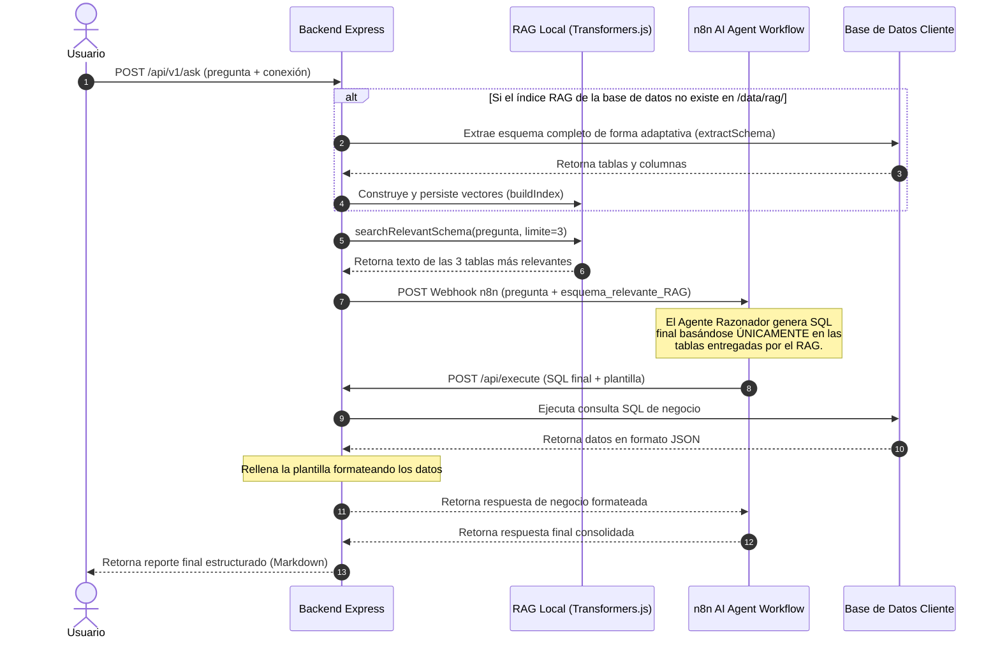

# Guía de Implementación: Sistema RAG Universal en Express (Node.js)

Esta guía describe cómo implementar e integrar un **sistema RAG (Retrieval-Augmented Generation)** en tu backend de Express, estructurado bajo la **Arquitectura Hexagonal** detallada en tu archivo de [specifications.md](file:///c:/Users/jair/Downloads/Archive%20(1)/specifications.md).

Para cumplir con el requerimiento de **funcionar para todas las bases de datos**, esta implementación utiliza:
1. **Knex.js** para conexiones y consultas dinámicas.
2. Un **extractor de esquemas adaptativo** que soporta PostgreSQL, MySQL/MariaDB, SQLite, MSSQL, Oracle y un fallback universal basado en el estándar ANSI SQL `information_schema.columns`.
3. Un **motor RAG embebido** en JavaScript puro (`@xenova/transformers` + similitud de coseno) que no requiere compilaciones binarias en C++ (evitando problemas de instalación de FAISS en entornos heterogéneos).

---

## 1. Actualización de la Estructura de Directorios

Integramos el sistema RAG respetando tu estructura hexagonal original, agregando los puertos y adaptadores necesarios para la vectorización y almacenamiento de los metadatos:

```text
backend-n8n-sql/
├── data/
│   └── rag/                     # [NUEVO] Almacenamiento local de índices vectoriales (JSON)
├── src/
│   ├── core/
│   │   ├── domain/
│   │   │   ├── AskModel.js
│   │   │   └── services/
│   │   │       └── FormatterService.js
│   │   ├── ports/
│   │   │   └── out/
│   │   │       ├── DatabasePort.js
│   │   │       ├── OrchestratorPort.js
│   │   │       └── RAGPort.js   # [NUEVO] Puerto para el motor RAG
│   │   └── useCases/
│   │       ├── AskUseCase.js    # [MODIFICADO] Envía el contexto del RAG a n8n
│   │       ├── ExecuteSqlUseCase.js
│   │       ├── RunRawQueryUseCase.js
│   │       └── BuildRagUseCase.js # [NUEVO] Caso de uso para indexar bases de datos
│   ├── adapters/
│   │   ├── in/
│   │   │   └── http/
│   │   │       ├── controllers/
│   │   │       │   ├── AskController.js
│   │   │       │   ├── DbController.js
│   │   │       │   └── RagController.js # [NUEVO] Controladores de administración RAG
│   │   │       └── routes.js    # [MODIFICADO] Rutas de la API e Inyección de dependencias
│   │   └── out/
│   │       ├── database/
│   │       │   └── KnexDatabaseAdapter.js # [MODIFICADO] Extractor de esquema multi-DB
│   │       ├── orchestrator/
│   │       │   └── N8nHttpAdapter.js
│   │       └── rag/
│   │           └── LocalRAGEngineAdapter.js # [NUEVO] Motor RAG local con Transformers.js
│   └── infrastructure/
│       ├── server.js
```

---

## 2. Dependencias Necesarias

Agrega las siguientes librerías a tu `package.json` para dar soporte a los embeddings locales y a las conexiones a múltiples motores:

```json
{
  "dependencies": {
    "@xenova/transformers": "^2.17.2",
    "express": "^4.19.2",
    "knex": "^3.1.0",
    "mysql2": "^3.10.1",
    "pg": "^8.12.0",
    "sqlite3": "^5.1.7",
    "better-sqlite3": "^11.0.0",
    "mssql": "^11.0.1",
    "oracledb": "^6.5.0"
  }
}
```

---

## 3. Adaptador de Base de Datos Universal (Knex)

Para que el RAG extraiga los metadatos (tablas y columnas) de cualquier base de datos, implementamos consultas adaptativas por dialecto en el adaptador de base de datos.

#### `src/adapters/out/database/KnexDatabaseAdapter.js`
```javascript
import knex from 'knex';
import { DatabasePort } from '../../../core/ports/out/DatabasePort.js';

export class KnexDatabaseAdapter extends DatabasePort {
  constructor() {
    super();
    this.connections = new Map();
  }

  /**
   * Crea o recupera una conexión Knex de forma dinámica
   */
  getConnection(connectionString) {
    if (this.connections.has(connectionString)) {
      return this.connections.get(connectionString);
    }

    // Detectar el tipo de base de datos a partir de la cadena de conexión
    let client = '';
    const connLower = connectionString.toLowerCase();

    if (connLower.startsWith('postgres://') || connLower.startsWith('postgresql://')) {
      client = 'pg';
    } else if (connLower.startsWith('mysql://') || connLower.startsWith('mysql2://')) {
      client = 'mysql2';
    } else if (connLower.startsWith('sqlite://') || connLower.startsWith('sqlite3://') || connLower.includes('.db')) {
      client = 'sqlite3';
    } else if (connLower.startsWith('sqlserver://') || connLower.startsWith('mssql://')) {
      client = 'mssql';
    } else if (connLower.startsWith('oracle://') || connLower.startsWith('oracledb://')) {
      client = 'oracledb';
    } else {
      throw new Error('No se pudo determinar el tipo de base de datos de la cadena de conexión.');
    }

    const config = {
      client,
      connection: client === 'sqlite3' ? { filename: connectionString.replace('sqlite://', '') } : connectionString,
      useNullAsDefault: client === 'sqlite3' ? true : undefined,
      pool: client !== 'sqlite3' ? { min: 1, max: 5 } : undefined
    };

    const connInstance = knex(config);
    this.connections.set(connectionString, connInstance);
    return connInstance;
  }

  async executeQuery(connectionString, sqlQuery) {
    const db = this.getConnection(connectionString);
    const result = await db.raw(sqlQuery);
    
    // Normalizar la salida para diferentes motores de base de datos
    const connLower = connectionString.toLowerCase();
    if (connLower.startsWith('postgres') || connLower.startsWith('pg')) {
      return result.rows || result;
    }
    if (connLower.startsWith('mysql')) {
      return result[0] || result;
    }
    if (result && result.rows) {
      return result.rows;
    }
    if (result && result.recordset) {
      return result.recordset;
    }
    return Array.isArray(result) ? result : [result];
  }

  /**
   * Extrae el esquema de la base de datos de forma adaptativa para CUALQUIER motor
   */
  async extractSchema(connectionString) {
    const db = this.getConnection(connectionString);
    const schema = {};
    const connLower = connectionString.toLowerCase();

    try {
      if (connLower.startsWith('postgres') || connLower.startsWith('pg')) {
        // PostgreSQL
        const res = await db.raw(`
          SELECT table_name, column_name 
          FROM information_schema.columns 
          WHERE table_schema = 'public'
        `);
        for (const row of (res.rows || res)) {
          const table = row.table_name;
          const col = row.column_name;
          if (!schema[table]) schema[table] = { columns: [] };
          schema[table].columns.push(col);
        }
      } 
      else if (connLower.startsWith('mysql')) {
        // MySQL / MariaDB
        const res = await db.raw(`
          SELECT table_name, column_name 
          FROM information_schema.columns 
          WHERE table_schema = DATABASE()
        `);
        for (const row of (res[0] || res)) {
          const table = row.table_name || row.TABLE_NAME;
          const col = row.column_name || row.COLUMN_NAME;
          if (!schema[table]) schema[table] = { columns: [] };
          schema[table].columns.push(col);
        }
      } 
      else if (connLower.includes('.db') || connLower.startsWith('sqlite')) {
        // SQLite
        const tables = await db.raw("SELECT name FROM sqlite_master WHERE type='table' AND name NOT LIKE 'sqlite_%'");
        for (const tRow of tables) {
          const tableName = tRow.name;
          const cols = await db.raw(`PRAGMA table_info(\`${tableName}\`)`);
          schema[tableName] = {
            columns: cols.map(c => c.name)
          };
        }
      } 
      else if (connLower.startsWith('sqlserver') || connLower.startsWith('mssql')) {
        // SQL Server (MSSQL)
        const res = await db.raw(`
          SELECT table_name, column_name 
          FROM information_schema.columns 
          WHERE table_schema = 'dbo'
        `);
        for (const row of (res.recordset || res)) {
          const table = row.table_name || row.TABLE_NAME;
          const col = row.column_name || row.COLUMN_NAME;
          if (!schema[table]) schema[table] = { columns: [] };
          schema[table].columns.push(col);
        }
      } 
      else if (connLower.startsWith('oracle')) {
        // Oracle
        const res = await db.raw(`
          SELECT table_name, column_name 
          FROM user_tab_cols
        `);
        for (const row of (res.rows || res)) {
          const table = row.table_name || row.TABLE_NAME;
          const col = row.column_name || row.COLUMN_NAME;
          if (!schema[table]) schema[table] = { columns: [] };
          schema[table].columns.push(col);
        }
      } 
      else {
        // FALLBACK UNIVERSAL (Estándar ANSI SQL Information Schema)
        try {
          const res = await db.raw(`
            SELECT table_name, column_name 
            FROM information_schema.columns 
            WHERE table_schema NOT IN ('information_schema', 'pg_catalog', 'performance_schema', 'sys', 'mysql')
          `);
          const rows = res.rows || res[0] || res;
          if (Array.isArray(rows)) {
            for (const row of rows) {
              const table = row.table_name || row.TABLE_NAME;
              const col = row.column_name || row.COLUMN_NAME;
              if (table && col) {
                if (!schema[table]) schema[table] = { columns: [] };
                schema[table].columns.push(col);
              }
            }
          }
        } catch (err) {
          console.warn('El fallback de extracción genérica falló:', err.message);
        }
      }
    } catch (error) {
      console.error('Error extrayendo el esquema:', error);
      throw new Error(`Error extrayendo metadatos de la base de datos: ${error.message}`);
    }

    return schema;
  }
}
```

---

## 4. Puerto y Adaptador del Motor RAG Local

#### `src/core/ports/out/RAGPort.js`
Define la firma para el motor RAG.
```javascript
export class RAGPort {
  async buildIndex(connectionHash, schema) {
    throw new Error('Método buildIndex no implementado');
  }
  async searchRelevantSchema(connectionHash, query, limit) {
    throw new Error('Método searchRelevantSchema no implementado');
  }
}
```

#### `src/adapters/out/rag/LocalRAGEngineAdapter.js`
Este adaptador implementa la tokenización de texto y generación de embeddings offline utilizando el modelo optimizado de HuggingFace `Xenova/all-MiniLM-L6-v2`. La persistencia se realiza escribiendo objetos vectorizados directamente en formato JSON.

```javascript
import fs from 'fs/promises';
import path from 'path';
import crypto from 'crypto';
import { RAGPort } from '../../../core/ports/out/RAGPort.js';

export class LocalRAGEngineAdapter extends RAGPort {
  constructor(persistPath = './data/rag') {
    super();
    this.persistPath = persistPath;
    this.modelPipeline = null;
    this.initPromise = null;
  }

  // Inicialización diferida (Lazy initialization) del pipeline de IA
  async init() {
    if (this.initPromise) return this.initPromise;
    this.initPromise = (async () => {
      const { pipeline } = await import('@xenova/transformers');
      this.modelPipeline = await pipeline('feature-extraction', 'Xenova/all-MiniLM-L6-v2');
      await fs.mkdir(this.persistPath, { recursive: true });
    })();
    return this.initPromise;
  }

  // Genera un hash seguro para usar como nombre del archivo del índice
  getConnectionHash(connectionString) {
    return crypto.createHash('md5').update(connectionString).digest('hex');
  }

  async generateEmbedding(text) {
    await this.init();
    const output = await this.modelPipeline(text, { pooling: 'mean', normalize: true });
    return Array.from(output.data);
  }

  // Cálculo matemático del Coseno entre dos vectores en JS puro
  cosineSimilarity(vecA, vecB) {
    let dotProduct = 0.0;
    let normA = 0.0;
    let normB = 0.0;
    for (let i = 0; i < vecA.length; i++) {
      dotProduct += vecA[i] * vecB[i];
      normA += vecA[i] * vecA[i];
      normB += vecB[i] * vecB[i];
    }
    if (normA === 0 || normB === 0) return 0;
    return dotProduct / (Math.sqrt(normA) * Math.sqrt(normB));
  }

  /**
   * Construye el índice vectorial de la base de datos y lo persiste en formato JSON
   */
  async buildIndex(connectionString, schema) {
    await this.init();
    const indexData = [];
    const hash = this.getConnectionHash(connectionString);

    for (const [tableName, info] of Object.entries(schema)) {
      const columns = info.columns || [];
      // Texto descriptivo para vectorizar la tabla
      const descriptionText = `Tabla: ${tableName}. Columnas: ${columns.join(', ')}.`;
      
      const vector = await this.generateEmbedding(descriptionText);
      indexData.push({
        table: tableName,
        text: descriptionText,
        vector
      });
    }

    const filePath = path.join(this.persistPath, `${hash}.json`);
    await fs.writeFile(filePath, JSON.stringify(indexData, null, 2), 'utf-8');
    console.log(`Índice RAG construido y guardado en: ${filePath}`);
  }

  /**
   * Busca las tablas más relevantes comparando la similitud vectorial con la pregunta del usuario
   */
  async searchRelevantSchema(connectionString, query, limit = 4) {
    await this.init();
    const hash = this.getConnectionHash(connectionString);
    const filePath = path.join(this.persistPath, `${hash}.json`);

    try {
      const fileContent = await fs.readFile(filePath, 'utf-8');
      const indexData = JSON.parse(fileContent);
      
      const queryVector = await this.generateEmbedding(query);

      const scored = indexData.map(item => {
        const score = this.cosineSimilarity(queryVector, item.vector);
        return { table: item.table, text: item.text, score };
      });

      // Ordenar por relevancia descendente
      scored.sort((a, b) => b.score - a.score);

      const topMatches = scored.slice(0, limit);
      console.log(`RAG Matches encontrados para: "${query}"`, topMatches.map(m => `${m.table} (${m.score.toFixed(2)})`));

      // Retornar en formato legible para la IA
      return topMatches.map(m => m.text).join('\n');
    } catch (err) {
      console.warn(`El índice RAG no existe o no pudo ser leído para este hash. Construyendo en caliente...`);
      return '';
    }
  }
}
```

---

## 5. Casos de Uso del Núcleo (Core Use Cases)

Ajustamos la lógica del negocio para integrar el RAG en el ciclo de ejecución.

#### `src/core/useCases/BuildRagUseCase.js` [NUEVO]
Caso de uso encargado de disparar la indexación RAG para una base de datos específica.

```javascript
export class BuildRagUseCase {
  constructor(databasePort, ragPort) {
    this.databasePort = databasePort;
    this.ragPort = ragPort;
  }

  async execute(connectionString) {
    if (!connectionString) {
      throw new Error('La cadena de conexión es obligatoria.');
    }
    
    // 1. Extraer metadatos
    const schema = await this.databasePort.extractSchema(connectionString);
    
    // 2. Construir e indexar vectores RAG
    await this.ragPort.buildIndex(connectionString, schema);
    
    return {
      message: 'Indexación completada correctamente.',
      tablesIndexed: Object.keys(schema).length
    };
  }
}
```

#### `src/core/useCases/AskUseCase.js` [MODIFICADO]
Modificamos el caso de uso principal para que busque en el RAG local y envíe a n8n **únicamente** las tablas y columnas pertinentes para responder la pregunta, evitando la saturación del contexto del LLM.

```javascript
import { AskModel } from '../domain/AskModel.js';

export class AskUseCase {
  constructor(orchestratorPort, ragPort, databasePort) {
    this.orchestratorPort = orchestratorPort;
    this.ragPort = ragPort;
    this.databasePort = databasePort;
  }

  async execute(connectionString, question) {
    // 1. Validación en capa de dominio
    const askModel = new AskModel({ db: connectionString, question });
    askModel.validate();

    // 2. Auto-construir índice RAG si no existiera previamente
    let schemaContext = await this.ragPort.searchRelevantSchema(connectionString, question, 3);
    
    if (!schemaContext) {
      console.log('Generando índice RAG inicial en caliente...');
      const schema = await this.databasePort.extractSchema(connectionString);
      await this.ragPort.buildIndex(connectionString, schema);
      schemaContext = await this.ragPort.searchRelevantSchema(connectionString, question, 3);
    }

    // 3. Invocar flujo n8n pasándole el fragmento de esquema relevante recuperado por el RAG
    const n8nPayload = {
      connection_string: connectionString,
      question: question,
      schema_context: schemaContext // Aquí enviamos el RAG
    };

    const response = await this.orchestratorPort.triggerWorkflow(n8nPayload);
    return response;
  }
}
```

---

## 6. Adaptadores de Entrada (Inbound Controllers & Routes)

Exponemos la funcionalidad RAG mediante nuevos endpoints HTTP.

#### `src/adapters/in/http/controllers/RagController.js` [NUEVO]
```javascript
export class RagController {
  constructor(buildRagUseCase) {
    this.buildRagUseCase = buildRagUseCase;
  }

  build = async (req, res, next) => {
    try {
      const { connection_string } = req.body;
      const result = await this.buildRagUseCase.execute(connection_string);
      return res.status(200).json({
        status: 'cod_ok',
        data: result,
        message: 'Índice RAG generado de forma exitosa'
      });
    } catch (err) {
      next(err);
    }
  };
}
```

#### `src/adapters/in/http/routes.js` [MODIFICADO]
Registramos el controlador RAG e inyectamos los nuevos puertos y adaptadores.

```javascript
import { Router } from 'express';
import { AskController } from './controllers/AskController.js';
import { DbController } from './controllers/DbController.js';
import { RagController } from './controllers/RagController.js';

import { AskUseCase } from '../../../core/useCases/AskUseCase.js';
import { BuildRagUseCase } from '../../../core/useCases/BuildRagUseCase.js';

import { KnexDatabaseAdapter } from '../../out/database/KnexDatabaseAdapter.js';
import { LocalRAGEngineAdapter } from '../../out/rag/LocalRAGEngineAdapter.js';
import { N8nHttpAdapter } from '../../out/orchestrator/N8nHttpAdapter.js';

const router = Router();

// 1. Inicialización de Adaptadores de Salida
const databaseAdapter = new KnexDatabaseAdapter();
const ragAdapter = new LocalRAGEngineAdapter('./data/rag');
const orchestratorAdapter = new N8nHttpAdapter();

// 2. Inicialización de Casos de Uso (Core)
const askUseCase = new AskUseCase(orchestratorAdapter, ragAdapter, databaseAdapter);
const buildRagUseCase = new BuildRagUseCase(databaseAdapter, ragAdapter);

// 3. Inicialización de Controladores
const askController = new AskController(askUseCase);
const ragController = new RagController(buildRagUseCase);

// 4. Rutas del Servidor API
router.post('/v1/ask', askController.ask);
router.post('/v1/rag/build', ragController.build);

export default router;
```

---

## 7. Flujo del Sistema Integrado con RAG

El flujo de información paso a paso al incorporar el motor RAG local se detalla a continuación:


